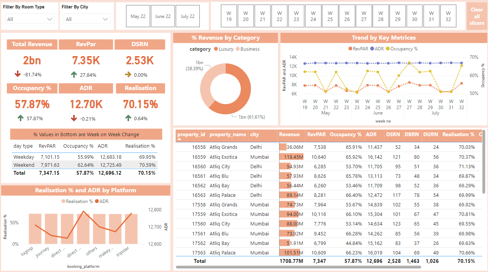
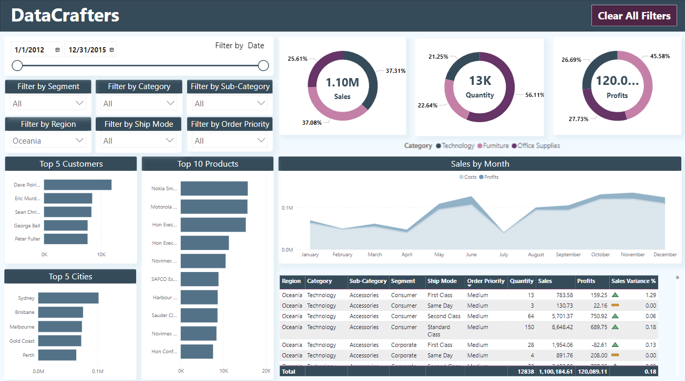
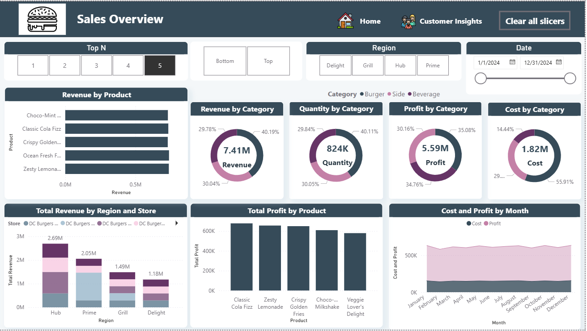
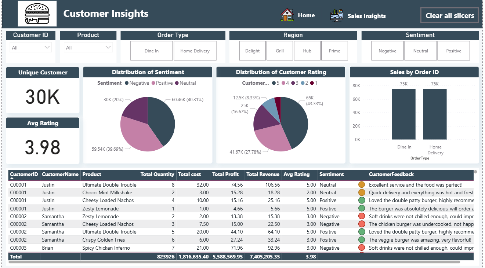

# Power BI Internship Projects

During my internship, I explored and mastered the fundamentals of Power BI, focusing on designing insightful dashboards and presenting data-driven insights effectively. Over the first three weeks, I worked on guided, unguided, and team projects, culminating in a presentation of my findings. Below is an overview of the projects I worked on and the skills I gained during this journey.

## Key Skills Acquired:
- Mastered Power BI basics: visuals, Power Query, and DAX for custom calculations.
- Transformed raw data into actionable insights, enabling informed decision-making.
- Gained expertise in data modeling: normalization, reducing redundancy, relationships, cardinality, and more.

---

## Guided Projects

### Hospitality Data Analysis

**Visualizations:**
- **KPIs**: Total Revenue, RevPAR, ADR
- **Donut Chart**: Revenue distribution by category
- **Line Chart**: Metric trends over time
- **Bar Chart**: Revenue by city
- **Combination Chart**: Realization % vs. ADR by platform

This project helped me develop a strong foundation in using Power BI's visualization tools for analyzing hospitality data and presenting insights effectively.

---

### Sales Data Analysis

**Visualizations:**
- **KPIs**: Quantity, Costs, Sales, Profits
- **Donut Chart**: Profits by category
- **Bar Charts**: Top products, cities, customers
- **Line Chart**: Sales trends over time
- **Descriptive Table**: Region, category, and more
- **Slicers**: Categorical columns and date filters

Special thanks to **Codebasics on YouTube** for their helpful tutorials that supported my understanding of Power BI concepts.

---

## Team Project: DC Burgers Dataset

In this collaborative project, my team worked on a dataset for DC Burgers containing columns such as order type, rating, region, store, sales, profit, quantity, and review descriptions. We designed a report with **three pages**, each providing specific insights.

### Page 1: Home Page
- A navigation bar to access different sections of the report seamlessly.

### Page 2: Sales Overview

This page provides a comprehensive analysis of DC Burgers' sales performance. Key insights include:
- **Revenue by Product**: Top products contributing to revenue.
- **Revenue, Profit, and Cost by Category**: Visualized through KPIs and donut charts.
- **Regional Breakdown**: A stacked bar chart showing total revenue by region and store.
- **Monthly Trends**: Cost and profit trends visualized in a line chart.

### Page 3: Customer Insights

This page highlights customer behavior and feedback:
- **Unique Customers and Average Rating**: Displayed as KPIs.
- **Sentiment Analysis**: A pie chart showing the distribution of positive, negative, and neutral reviews.
- **Customer Ratings**: Another pie chart showing the breakdown of ratings from 1 to 5.
- **Sales by Order Type**: Bar chart comparing dine-in and home delivery sales.
- **Customer Feedback Table**: Detailed table showing individual customer orders, sentiment, ratings, and comments.

---

I’m proud of my journey in mastering Power BI and look forward to applying these skills to solve real-world data problems in the future!
